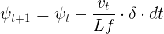

# Model Predictive Control for Autonomous Cars
<figure>
  <a href="https://www.youtube.com/watch?v=psoxAdS4UHk&feature=youtu.be">
  
</figure>
</a>
 <p></p>

### Overview
In a [previous repository](https://github.com/sathomas2/CarND-PID-Control-Project), I implemented a proportional-integral-derivative (PID) controller to navigate the lake track in Udacity's self-driving car simulator. Now I will up my game and implement a model predictive controller (MPC) on the same track.

The contents of this repository include:
```
root
|   .gitignore
|   CMakeLists.txt
|   CODEOWNERS
|   DATA.md
|   README.md
|   cmakepatch.txt
|   install-mac.sh
|   install-ubuntu.sh
|   install_Ipopt_CppAD.md
|   install_ipopt.sh
|   lake_track_waypoints.csv
|   project_assignment.md
|
|___readme_images
|   |   
|   |   ...
|   
|___src
    |   MPC.cpp
    |   MPC.h
    |   json.hpp
    |   main.cpp
```
Everything in the root directory, except for this README, was provided by Udacity. Most of it is to install the necessary dependencies, including Ipopt, the tool used to optimize the control inputs, and CppAD, the library used for automatic differentiation to avoid having to manually compute derivatives. CODEOWNERS is the citation of the author of the starter code. DATA.md describes the JSON object send back from the simulator. The readme_images directory contains the images in this README. lake_track_waypoints.csv contains the waypoints of the track in global coordinates. main.cpp connects to the simulator using WebSocketIO and makes the necessary calls to the MPC class. MPC.cpp contains my implementation of the MPC.

### Fitting the Waypoints
Approximately fifty times per second the simulator spits out a JSON object containing information about the car. This is detailed in DATA.md and includes waypoints (ptsx and ptsy) from precisely the middle of the lane. I fit a second-order polynomial to these to calculate my heading-angle error (EPSI) and cross-track error (CTE), and to plot in real time the ideal path the car should take (the yellow line). To make life easier later on, I convert the waypoints from global to vehicle coordinates so that at any given time the x-y position of the car is [0,0]. This involves a translation then a rotation. The formalae for this are
<figure>
  
</figure>
 <p></p>
 <figure>
  
</figure>
 <p></p>
where wx and wy are the waypoints, px and py are the car's position, psi is the global heading angle in radians. See main.cpp lines 92-103.

### Dealing with 100 Millisecond Latency
In vehicle coordinates, the current x-y position of the car is [0,0]. Since there will be a 0.1 second lag before the control inputs are sent to the simulator, I calculate car's position in 0.1 seconds. First I convert the velocity from miles per hour to meters per second (main.cpp lines 16, 108). Then,
<figure>
  
</figure>
 <p></p>
 <figure>
  
</figure>
 <p></p>
where psi is now the steering angle (i.e., the heading angle in vehicle coordinates).
 
### Calculating the Errors (CTE and EPSI)
The CTE is the difference between the y position of the polynomial fitted to the waypoints at x_latency and y_latency (main.cpp line 111).

EPSI is the difference between the steering angle and the desired steering angle (main.cpp line 112). The desired steering angle is the arctangent of the derivative of the fitted polynomial at x_latency, or:
 <figure>
  
</figure>
 <p></p>
 
### Global Kinematic Model
Given a car's current state -- i.e., its position (x and y), velocity (v), heading angle (psi), CTE, and EPSI at timestep t -- I need a model that can predict its next state at timestep t+1 and what control inputs I can provide to alter its state. The control inputs of a car are its steering angle (delta) and throttle (a), assuming that a negative a implies braking. For my MPC controller, I use a global kinematic model, which simplifies the problem by ignoring tire forces, gravity, and mass. With trigonemtry and physics, I can derive the following equations:
<figure>
  
</figure>
 <p></p>
 <figure>
  
</figure>
 <p></p>
 
In the simulator, the throttle, which determines the car's acceleration, must be between -1 and 1. Although a throttle value of 1 rarely if ever translates to an acceleration value of 1 meter per second squared, for simplicity I will assume this is the case. Therefore,
 <figure>
  
</figure>
 <p></p>
 
Udating psi is a bit tricky. Since I always assume the origin of the coordinate system is the car's position at timestep 0, the initial psi is the car's steering angle. As the car's state evolves through time, the origin cannot change or else the above equations would be meaningless. In other words, to derive psi at t+1, I cannot simply use the new steering angle. Essentially, I add a multiplicative factor of the new steering angle or delta to the previous psi.
 <figure>
  
</figure>
 <p></p>

Lf is the distance from the front of the car to its center of gravity. Intuitively, this makes sense because bigger cars have slower turn rates. The velocity is included because the faster the car travels the faster it turns.

The CTE update is the CTE plus the change in error caused by the car's motion.
<figure>
  
</figure>
 <p></p>
 where f is the second-order polynomial fitted to the waypoints.
 
 The EPSI update is the EPSI plus the change in error caused by the car's motion.
 <figure>
  
</figure>
 <p></p>
 
### Cost Function
I want to find the optimal control inputs, delta and a, to send to the simulator after a new JSON object is received so that the car safely traverses the track at high speeds. To this end, I create a cost function, using some combination of the state and actuator variables, that mathematically represents the ideal car behavior, so that the chosen delta and a satisfy the above model constraints while minimizing the cost over time. In other words, I punish certain behaviors. For example, a high CTE or EPSI increases the cost. I describe the reasoning behind the different parts of my cost function in the notes in the code. See MPC.cpp lines 60-68, 100-117. In addition to choosing what to punish, I need to weight each individual punishment. For example, if the car is travelling below the desired velocity, it is punished less than if it has a high EPSI. I tuned the weights manually. At the end of MPC.cpp, I blocked out a section of code that prints how much each part of the cost function adds to the overall cost. During tuning, this helped me decide how to weight each part. See lines 246-292.

### Choosing a Reference Velocity
One part of the cost function is the squared difference of the car's current velocity and its reference velocity (MPC.cpp line 68). The reference velocity does not stay constant because some parts of the track are relatively straight while others have relatively sharp turns. In main.cpp, I calculate the radius of the curve of the polynomial fitted to the waypoints. The radius of the curve is defined as
 <figure>
  
</figure>
 <p></p>

If the radius of the curve is large, the reference velocity is high (up to 100mph). If its small, the reference velocity is low. This helps the car navigate the turns by allowing it to anticpate them. See main.cpp lines 114-121.

### Timestep Length and Elapsed Duration (N and dt)
After each JSON object is received, to calculate the control inputs sent to the simulator the MPC calculates a new course. Although it only sends the first delta and a to the simulator, it projects into the future as well. This predictive aspect is why the MPC is much smoother and more successful than my PID controller. Ultimately I chose N=20 and dt=0.05, so my MPC projects 1 second into the future. A lower dt allows the controller to make more frequent actuations. In the case of this simulator, without latency, the controller actually interacts with the simulator much more frequently that every 0.05 seconds. I initially tried 0.02, but that many actuations caused the car to turn too frequently and spin out of control. I also tried 0.10 and higher to try to account for the latency, but that appeared to be too long. As for N=20, any more time steps causes the cost to explode, making it hard for the cost to stabilize. Simply, more predictions mean more cost is added. Also the more N the greater the computational expense. I could probably have chosen slightly different values for N and dt, but this would require retuning the cost weights. Intutively, 1 second projections seem reasonable, especially at higher speeds.

### Results
With latency, the car travels between 50-90mph. Click on the picture below to check it out. 
<figure>
  <a href="https://www.youtube.com/watch?v=psoxAdS4UHk&feature=youtu.be">
  
</figure>
</a>
 <p></p>

Without latency, the car gets up to 100mph, but for this to work the reference velocity code in main.cpp and the cost weights in MPC.cpp need to be altered. Click on the picture at the top of this README to see the car hit 100mph!
